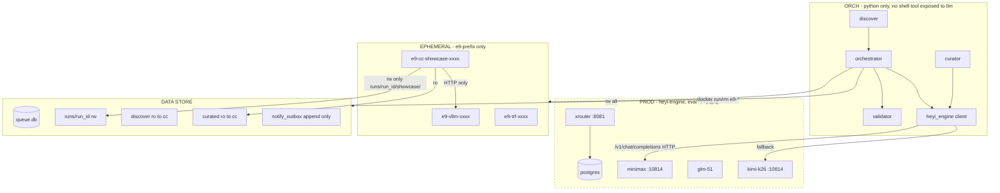
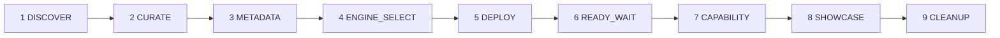

> **状态（2026-05-25）**：这是 v10 **启动期的设计文档与 PR 序列规划**，保留作为 design rationale。
> 当前**运行时真相**（已演进至 11 阶段，包含 PR#31 STAGE_MODEL 与 PR#26 PERF_BENCH）请看 [`ARCHITECTURE.md`](ARCHITECTURE.md)。
> 本文的 9 阶段图、`compose.yml`、`cc-agent/` 目录拼写等已不反映现状。

---
name: heyi-eval-v10 architecture
overview: 基于 v9 incident 与 heyi-engine 调研结果，重新设计严格信任域分离的评测流水线。新开 heyi-eval-v10 仓库，将 DEPLOY/READY_WAIT/CAPABILITY/CLEANUP 4 个原 cc-agent 阶段全部 Python 化，cc-agent 仅保留 SHOWCASE 一个阶段且彻底去掉 shell + docker socket，LLM 走本地 :10814 自动发现，加上 30 分钟级备份。按 rules § 阶段 1-4 分阶段开发，feature branch + PR + E2E。
todos:
  - id: pr1-bootstrap
    content: "PR#1 chore: bootstrap v10 repo + migrate static modules (discover/curator/panel/state_machine/store/validator + tests)"
    status: pending
  - id: pr2-heyi-engine
    content: "PR#2 feat(heyi-engine): client with auto model discovery + health probe + curator wiring"
    status: pending
  - id: pr3-stages-deploy
    content: "PR#3 feat(stages): deploy + ready_wait + cleanup in python (docker SDK)"
    status: pending
  - id: pr4-stages-capability
    content: "PR#4 feat(stages): capability in python (gsm8k/mmlu/humaneval mini slices)"
    status: pending
  - id: pr5-cc-agent-showcase
    content: "PR#5 feat(cc-agent): restricted showcase runner (no shell, no docker, ro most mounts)"
    status: pending
  - id: pr6-backup
    content: "PR#6 feat(backup): 30min rsync + retain 7d + panel cards + mac nightly mirror"
    status: pending
  - id: pr7-deploy
    content: "PR#7 feat(deploy): compose v10 + systemd full set + bootstrap_nv8.sh + cleanup of CCR/socket-proxy"
    status: pending
  - id: pr8-e2e
    content: "PR#8 test(e2e): full pipeline run with Qwen2.5-0.5B + INV-1/INV-4 prod containers untouched + 24h timer validation"
    status: pending
isProject: false
---

# heyi-eval-v10 Architecture

## 1 · 设计原则（incident 教训直接转译为约束）

| 教训 | 约束 |
|---|---|
| cc-agent 拿到 `/heyi-eval-data:/workspace` rw + bash 工具 → 删了 sqlite | cc-agent 只 mount `/workspace/runs/<run_id>/showcase/`，且**没有 bash 工具** |
| cc-agent 有 docker socket → 可以构造任意 mount 攻击 | cc-agent **完全没有 docker socket**；docker 调度只由 Python orchestrator 做 |
| CCR 直连 `:10814` raw vllm，model name 写死，user 换模型就 404 | heyi_engine client **自动 probe `/v1/models`** 拿真实 served_model_name |
| heyi-engine 边界模糊，eval 与 production 容器混用同一 docker 命名空间 | INV-1 硬约束：eval 只动 `e9-*` 前缀容器 + `/home/ai/heyi-eval-data/` 数据 |
| sqlite 单点，没备份，被删就全没了 | 30 min rsync 到独立目录 + nightly Mac 同步 |

## 2 · 信任域



## 3 · 9 阶段全部归属（incident 后重新划分）



| 阶段 | v9 实现 | **v10 实现** | 改动 |
|---|---|---|---|
| 1 DISCOVER | python stub | python stub | unchanged |
| 2 CURATE | python + heyi_engine | python + heyi_engine | client 重写为 auto-discover |
| 3 METADATA | python + HF Hub | python + HF Hub | unchanged |
| 4 ENGINE_SELECT | python 决策树 | python 决策树 | minor |
| **5 DEPLOY** | **cc-agent + bash + docker** | **python** | 用 docker SDK 直 run `e9-vllm-<short>`，参数模板由 `engine.json` 驱动 |
| **6 READY_WAIT** | python stub | **python HTTP probe** | 轮询 `e9-vllm` 的 `/v1/models`，10 min 超时 |
| **7 CAPABILITY** | **cc-agent + bash** | **python** | 直接对 `e9-vllm` 跑 dataset 脚本（gsm8k/mmlu/humaneval 小切片） |
| **8 SHOWCASE** | cc-agent w/ full powers | **cc-agent restricted** | 只挂 `runs/<run_id>/showcase/:rw` + `curated.json/metadata.json/modelcard.md:ro`；**无 bash**；只能 Read/Write；HTTP 客户端访问 e9-vllm |
| **9 CLEANUP** | **cc-agent + docker rm** | **python** | docker SDK `containers.get('e9-...').remove(force=True)`，名字白名单校验 |

**结果**：cc-agent 从 4 个阶段缩到 1 个，且这 1 个里 Claude 没有任何执行环境，只是"生成 prompt 文本 + 调用 HTTP 端点拿结果"——本质等同于一个 LLM agent 写文案，不再是 shell 编排者。

## 4 · 核心新组件

### 4.1 `heyi_engine/client.py`（新）

```python
class HeyiEngineClient:
    """Single source of truth for all LLM calls in v10.

    - On init: probe http://127.0.0.1:10814/v1/models, pin served_model_name.
    - Periodic: refresh model_id every 60s (so user swapping :10814 model is detected).
    - call(messages, **kw): /v1/chat/completions, returns text + token usage.
    - health(): returns (ok, detail) for orchestrator preflight gate.
    - Used by: curator.enricher, showcase HTTP helper, orchestrator preflight.
    """
```

启动时 GET `:10814/v1/models` → 取 `data[0].id` 当 served name；如果 :10814 down，`health()` 返回 not-ok，orchestrator 暂停取任务（队列保留）。

### 4.2 `orchestrator/stages_py.py`（新，取代 v9 的 cc 路径）

`execute_deploy/execute_capability/execute_cleanup` 全部 Python，docker 用 `docker-py` SDK。

### 4.3 `cc-agent/showcase_runner.py`（重写）

不再是 bash 入口，改成纯 Python 入口：
- 读 `/workspace/runs/<run_id>/_meta/{curated,metadata,modelcard}.{json,md}`
- 用 `HeyiEngineClient` 生成 showcase prompt
- 把 prompt 发给 `e9-vllm` 拿响应
- 写 `/workspace/runs/<run_id>/showcase/{items.json,model_first_impression.txt,summary.md}`

容器内**没装 docker CLI、没装 claude CLI、没 mount socket**。

### 4.4 `backup/snapshot.py`（新）

```bash
*/30 * * * *  rsync -a --delete /home/ai/heyi-eval-data/ \
               /home/ai/heyi-eval-backups/$(date +%Y-%m-%d_%H%M)/
# retain 7d, drop older via find -mtime +7
```

外加 Mac side cron 每天 02:00 pull `heyi-eval-backups/latest/` 镜像一份到本地。

### 4.5 `panel/` （沿用 v9）

只改读 path（v10 数据根路径）+ 加备份状态卡片。

## 5 · 关键不变量（INV）

- **INV-1**: 容器层只动 `e9-*` 前缀；数据层只动 `/home/ai/heyi-eval-data/`。orchestrator + validator 同时校验。
- **INV-2**: 所有 LLM 调用经 `HeyiEngineClient`；禁止业务代码出现 `openai.Client` / 裸 `requests.post(":10814")`。Pre-commit hook 拦截。
- **INV-3**: cc-agent 容器 spec 里 `mounts` 只允许 `runs/<run_id>/showcase/:rw` + 3 个 `:ro` artifact + 工作目录 `/tmp:rw`；docker socket 必须不在 mount 列表。orchestrator 构造命令时硬编码，无配置入口。
- **INV-4**: docker socket 只挂给 orchestrator 自己（systemd unit `User=ai` 即可，复用 docker group 权限），cc-agent 完全不接触 socket。
- **INV-5**: orchestrator 主循环每次 dequeue 前调 `client.health()`；不通则暂停 60s 重试，不消队列。
- **INV-6**: 30 min rsync 备份到 `~/heyi-eval-backups/<ts>/`，保留 7d；备份成功后写 timestamp 到 `store/last_backup.txt`，panel 读取展示。
- **INV-7**: 每个阶段 artifact 必须通过 `validator.validate_<stage>()`，schema 不通过即 stage failed，没有 advisory 通道。
- **INV-8**: cc-agent showcase 进程超时 60 min；超时由 orchestrator wall-clock 强制 docker rm（不依赖容器内 timeout）。

## 6 · 仓库与开发流程（按 rules § 09-cicd）

新仓库：`~/Desktop/all/heyi-eval-v10/`（gh repo create private）。
默认分支 `main`，48h 内 enable branch protection。
所有变更走 feature branch + PR + AI review + squash merge。

迁移清单（v9 → v10，直接 cp，少量 patch）：
- `discover/` 全部
- `curator/` 全部（但 `enricher.py` 切换到 `HeyiEngineClient`）
- `panel/` 全部
- `orchestrator/{state_machine,store,validator,notify,config}.py`
- `tests/` 凡测试上述模块的全部
- `sops/known_quirks.md`（保留 Q-001..Q-021，新增 Q-022 数据丢失/Q-023 cc-agent 沙箱）
- `deploy/systemd/{discover,enqueue,panel}.{service,timer}` 全部

重写（不复用）：
- `orchestrator/stages.py` → `stages_py.py`（4 个 CC 阶段重写为 Python）
- `cc-agent/` 全部
- `deploy/compose.yml`（移除 CCR + socket-proxy；新增 backup-cron）
- `ccr/` 整个目录（不再使用 CCR；本地 :10814 直连）

## 7 · PR 序列（每个 PR ≤ 400 行，按依赖顺序）

1. **PR#1 `chore: bootstrap v10 repo + migrate static modules`**
   - 创建 v10 仓库；迁移 discover/curator/panel/state_machine/store/validator/notify + tests
   - 此 PR 只做 `cp -r` + import 路径调整，不改逻辑
2. **PR#2 `feat(heyi-engine): client with auto model discovery + health probe`**
   - 新增 `heyi_engine/client.py` + 单测（mock :10814 响应）+ 替换 curator 内 ccr 调用
3. **PR#3 `feat(stages): deploy + ready_wait + cleanup in python`**
   - `stages_py.py` 三个 stage 的 Python 实现 + docker SDK 封装 + 测试
4. **PR#4 `feat(stages): capability in python (gsm8k/mmlu 切片)`**
   - 用 lm-eval-harness mini 模式或自写小评测 + 单测
5. **PR#5 `feat(cc-agent): restricted showcase runner (no shell, no docker)`**
   - 重写 cc-agent；新 Dockerfile；新启动方式 + 测试
6. **PR#6 `feat(backup): 30min rsync + retain 7d + panel cards`**
   - backup/snapshot.py + cron unit + panel 改动
7. **PR#7 `feat(deploy): compose v10 + systemd full set + bootstrap script`**
   - 新 compose.yml + systemd units + bootstrap_nv8.sh
8. **PR#8 `test(e2e): full pipeline run with Qwen2.5-0.5B + smoke`**
   - 端到端测试脚本，验收 9 阶段 + 全部 artifact 入盘 + cleanup 后 e9-* 清零

每个 PR 配套：
- 单测覆盖率 ≥ 80%（rules § 09-cicd）
- Self-Review 后 mark "self-review done"
- AI Reviewer 首过；P0/P1 全部处理
- 通过 CI（ruff + mypy --strict + pytest）

## 8 · E2E 验收

最终验收用例（PR#8）：
1. 部署到 nv8 全套（compose + systemd）
2. enqueue `Qwen/Qwen2.5-0.5B-Instruct` 一个 run
3. 等 9 阶段全跑完（预期 15-25 min）
4. 校验：
   - `runs/<run_id>/state.json` 9 阶段全部 `status: ok`
   - 每阶段产出物存在且 schema 通过
   - `e9-vllm-*` 容器在 CLEANUP 后清零
   - `e9-cc-showcase-*` 容器在 SHOWCASE 后清零
   - `xrouter` / `minimax` / `glm-51` / `kimi-k26` 容器**完全未被触碰**（docker events 校验）
   - `/home/ai/heyi-eval-data/` 之外的 host 路径无任何写入
   - 备份目录有至少 1 个 snapshot
   - panel `/results` 能看到这一行
5. 监控 24h，validate 自动化（discover.timer + enqueue.timer + backup.timer）三个 timer 都正常触发

## 9 · 移除/降级清单

- `ccr/` 整个目录（CCR 不再需要，本地 :10814 直连）
- `deploy/compose.yml` 中的 `heyi-eval-ccr` 和 `heyi-eval-socket-proxy` 服务
- `cc-agent/tasks/{deploy,capability,cleanup}.md`（这 3 个阶段不再用 cc-agent）
- `cc-agent/run_cc.sh` 内 docker socket 相关代码（保留 stage 4 CCR sanity 改为 :10814 sanity，其余 stage 1-3 npm/apt 大幅简化）

## 10 · 已知风险与缓解

| 风险 | 缓解 |
|---|---|
| `:10814` 上 user 换模型期间 client probe 失败 | client 60s refresh + orchestrator preflight pause；队列不消 |
| docker-py SDK 版本与 nv8 docker daemon 不兼容 | PR#3 单测覆盖 + compose 启动时 health check |
| 大模型 vllm OOM 把 :10814 上 production 模型挤死 | engine_select 决策树限制 vllm tp 与 max_model_len；INV 提示在 user 模型在跑时跳过 ≥ 30B 模型 |
| 备份目录撑爆 `/home` | 7d 保留 + 单次 rsync size 监控 + alert 阈值 80% |
| cc-agent 即使没 bash，Claude 通过 Write 工具往 showcase/ 写出可执行脚本然后调 e9-vllm 反向利用 | cc-agent 不暴露 Bash + 网络白名单只能到 `127.0.0.1:<e9-vllm-port>` + `127.0.0.1:10814`，无法 outbound |